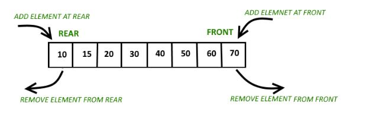

# 덱(Deque)

- double ended queue 의 줄임말
- 큐는 한 쪽에서 넣고, 반대 쪽에서 빼는 구조였다면, 덱은 양쪽 모두 삽입/삭제가 가능한 자료 구조
- 큐를 구현했는데 양쪽에서 출력하고 싶을 때 혹은
  스택을 구현했는데 양쪽에서 입력하고 싶을 때 덱을 사용(즉, 큐와 스택의 성질을 모두 가지고 있는 자료구조)
- 덱은 보통 스케줄링에서 사용하게 됨
  - 예로, 먼저 들어온 것을 우선순위를 높이기 위해서는 앞에서 빼낼 수 있어야하는데 **스택에서는 불가능** 하고, 반대로 최근에 들어온 것을 우선순위를 주고싶은데 이 때는 **큐의 구조에서는 불가능**하기 때문에 앞뒤로 출입이 가능한 **덱이 사용되기에 적합**하다.

# 덱의 시간복잡도

- 사이즈를 알아보는 연산을 제외하고 모든 작업들의 시간복잡도는 **O(1)** 이다.
- 사이즈를 알아보는 연산의 경우에는 배열의 경우 **O(1)** 이고 링크드리스트로 구현시 **O(n)** 이다.

# 덱의 구현 (JAVA)



- [백준 온라인저지 10866](https://www.acmicpc.net/problem/10866) - 덱

> - push_front X: 정수 X를 덱의 앞에 넣는다.
> - push_back X: 정수 X를 덱의 뒤에 넣는다.
> - pop_front: 덱의 가장 앞에 있는 수를 빼고, 그 수를 출력한다. 만약, 덱에 들어있는 정수가 없는 경우에는 -1을 출력한다.
> - pop_back: 덱의 가장 뒤에 있는 수를 빼고, 그 수를 출력한다. 만약, 덱에 들어있는 정수가 없는 경우에는 -1을 출력한다.
> - size: 덱에 들어있는 정수의 개수를 출력한다.
> - empty: 덱이 비어있으면 1을, 아니면 0을 출력한다.
> - front: 덱의 가장 앞에 있는 정수를 출력한다. 만약 덱에 들어있는 정수가 없는 경우에는 -1을 출력한다.
> - back: 덱의 가장 뒤에 있는 정수를 출력한다. 만약 덱에 들어있는 정수가 없는 경우에는 -1을 출력한다.

# 구현 소스(JAVA)

<!-- **<No Library .ver>**

```java

``` -->

**<Library .ver>**

```java
import java.util.ArrayDeque;
import java.util.Scanner;

public class Main {
    public static void main(String[] args) {
        Scanner sc = new Scanner(System.in);
        int cmdSize = sc.nextInt(); // 첫 줄 입력 사이즈
        sc.nextLine(); //nextInt()에서 발생하는 개행문자 제거
        ArrayDeque<Integer> queue = new ArrayDeque<Integer>(); //덱 라이브러리 선언

        for (int k = 0; k < cmdSize; k++) {
           String line = sc.nextLine(); //문자열 입력
           String[] s = line.split(" "); //스페이스로 문자열 구분해서 배열에 입력
           String cmd = s[0]; // cmd<-문자열 입력 부분

            if (cmd.equals("push_front")) { //정수 x를 덱의 앞에 넣음
                int num = Integer.parseInt(s[1]); //int로 형변환
                queue.offerFirst(num);
            } else if (cmd.equals("push_back")) { // 정수 x를 덱의 뒤에 넣음
                int num = Integer.parseInt(s[1]);
                queue.offerLast(num);
            } else if (cmd.equals("front")) {
                if (queue.isEmpty()) {
                    System.out.println("-1");
                } else {
                    System.out.println(queue.peekFirst()); //덱의 가장 앞에 있는 수 출력
                }
            } else if (cmd.equals("size")) { //덱에 들어있는 정수 개수 출력
                System.out.println(queue.size());
            } else if (cmd.equals("empty")) {
                if (queue.isEmpty()) {
                    System.out.println("1");
                } else {
                    System.out.println("0");
                }
            } else if (cmd.equals("pop_front")) {
                if (queue.isEmpty()) {
                    System.out.println("-1");
                } else {
                    System.out.println(queue.pollFirst()); //덱의 가장 앞에 있는 수를 빼고 그 수 출력
                }
            } else if (cmd.equals("pop_back")) {
                if (queue.isEmpty()) {
                    System.out.println("-1");
                } else {
                    System.out.println(queue.pollLast()); //덱의 가장 뒤에 있는 수를 빼고 그 수 출력
                }
            } else if (cmd.equals("back")) {
                if (queue.isEmpty()) {
                    System.out.println("-1");
                } else {
                    System.out.println(queue.peekLast()); //덱의 가장 뒤에 있는 수 출력
                }
            }

        }

    }
}
```

# 참고(Reference)

> - [code.plus 코드플러스 알고리즘](https://code.plus/course/41)
>
> - https://iq.opengenus.org/deque-in-cpp-stl/

<!-- 나중에 참고해볼 또 다른 풀이방법 -->
<!--https://blog.naver.com/justkukaro/220515795433 -->
<!-- https://jhnah917.tistory.com/56 -->
