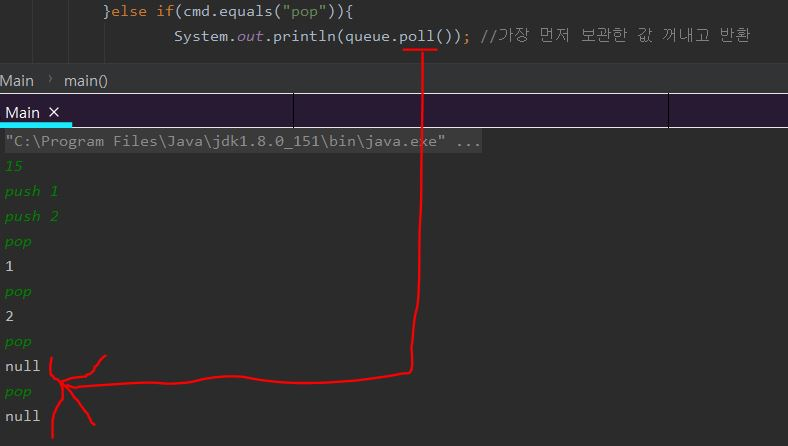
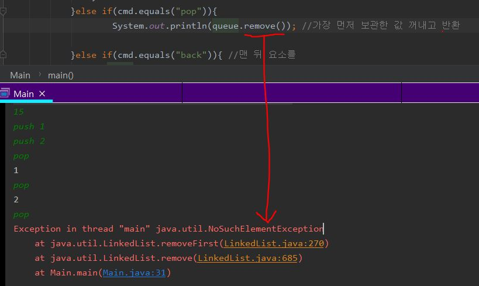

# 큐(Queue)

- 한쪽 끝에서만 자료를 넣고 다른 한쪽 끝에서만 뺄 수 있는 자료구조

- 먼저 넣은 것이 가장 먼저 나오기 때문에 First In First Out(FIFO) 라고 함

- java.util.Queue를 사용하면 큐를 사용해야하는 알고리즘에서 구현하기가 더 쉽다.
- BFS 문제 때 많이 활용됨!

# 큐의 구현 (JAVA)

> - push:큐에 자료를 넣는 연산
> - pop:큐에서 자료를 빼는 연산
> - front: 큐의 가장 앞에 있는 자료를 보는 연산
> - back:큐의 가장 뒤에 있는 자료를 보는 연산
> - empty:큐가 비어있는지 아닌지를 알아보는 연산
> - size:큐에 저장되어있는 자료의 개수를 알아보는 연산

### `<push>` : O(1)의 시간복잡도

```java
void push(int data){
    queue[end]=data;
    end +=1;
}
```


> end자리에 요소를 push 하고 , end는 마지막 요소 다음을 가리키게한다.

### `<pop>`: O(1)의 시간복잡도

```java
int pop(){
    queue[begin]=0;
    begin +=1;
}
```


> begin에 있는 요소를 pop 하고, 다음 요소를 가리키게한다.

### `<empty>`

```java
bool empty(){
    if(begin==end) return true;
    else return false;
}
```

> begin~end-1까지가 요소를 나타내는 index이므로, begin==end 라면 비어 있는 것이다.

### `<size>`

```java
int size(){
   return end-start;
}
```

> begin~end-1까지가 요소를 나타내기때문에 end-start가 요소 개수를 나타내겠다.

# 구현 소스(JAVA)

- [백준 온라인저지 10845](https://www.acmicpc.net/problem/10845) - 큐

**<No Library .ver>**

```java
import java.util.Scanner;

public class Main {
    public static void main(String[] args) {
        Scanner sc = new Scanner(System.in);
        int cmdSize = sc.nextInt(); // 첫 줄 입력 사이즈
        int[] queue = new int[cmdSize]; //입력사이즈만큼 큐 배열 초기화
        int begin = 0;
        int end = 0;


        while (cmdSize-- > 0) {
            String cmd = sc.next(); //입력

            if (cmd.equals("push")) { //push 라면
                int num = Integer.parseInt(sc.next()); //문자열을 int로 형변환
                queue[end++] = num;
            } else if (cmd.equals("front")) { //front 라면
                if (begin == end) { //큐가 비었으면
                    System.out.println("-1");
                } else { //맨 앞부분 출력
                    System.out.println(queue[begin]);
                }
            } else if (cmd.equals("size")) { //큐에 들어있는 정수갯수 출력
                System.out.println(end - begin);
            } else if (cmd.equals("empty")) {
                if (begin == end) { //큐가 비어있으면
                    System.out.println("1");
                } else {
                    System.out.println("0");
                }
            } else if (cmd.equals("pop")) {//큐에 가장 앞에 있는 정수를 빼고, 그 수를 출력
                if (begin == end) {
                    System.out.println("-1");
                } else {
                    System.out.println(queue[begin]);
                    begin++;
                }
            } else if (cmd.equals("back")) { //큐 가장 뒤에 있는 정수 출력
                if(begin==end){
                    System.out.println("-1" );
                }else{ //가장 뒤에 있는 정수 출력
                    System.out.println(queue[end-1]);
                }
            }
        }
    }
}
```

**<Library .ver>**

```java
import java.util.LinkedList;
import java.util.Queue;
import java.util.Scanner;

public class Main {
    public static void main(String[] args) {
        Scanner sc = new Scanner(System.in);
        int cmdSize = sc.nextInt(); // 첫 줄 입력 사이즈
        Queue<Integer> queue= new LinkedList<Integer>();

        for(int k=0;k<cmdSize;k++){
            String cmd=sc.next();
            if(cmd.equals("push")){
                int num=Integer.parseInt(sc.next());
                queue.offer(num); //push하는 메소드
            }else if(cmd.equals("front")){
                if(queue.isEmpty()){
                    System.out.println("-1");
                }else{
                    System.out.println(queue.peek()); //가장 먼저 보관한 값 단순 참조(꺼내지 않음)
                }
            }else if(cmd.equals("size")){
                System.out.println(queue.size()); //큐에 들어있는 정수갯수 출력
            }else if(cmd.equals("empty")){
                if(queue.isEmpty()){
                    System.out.println("1");
                }else{
                    System.out.println("0");
                }
            }else if(cmd.equals("pop")){
                if(queue.isEmpty()){
                    System.out.println("-1");
                }else{
                    System.out.println(queue.poll()); //가장 먼저 보관한 값 꺼내고 반환
                }
            }else if(cmd.equals("back")){ //맨 뒤 요소를
                if(queue.isEmpty()){
                    System.out.println("-1");
                }else{
                    System.out.println( ((LinkedList<Integer>) queue).peekLast()); //맨 뒤 요소 출력
                }

            }
        }
    }
}
```

> - queue.offer(num) : 큐에 push하는 메소드
> - queue.peek() : 맨 앞 요소 값 반환(꺼내지 않음)
> - queue.size() : 큐에 들어있는 크기 반환
> - queue.isEmpty(): 큐가 비어있는지 체크, 비어있으면 true, 아니면 false 반환
> - ((LinkedList<Integer>) queue).peekLast() :링크드리스트에 있는 메소드로, 맨 마지막 요소 반환(꺼내지 않음)
> - queue.poll() : 맨 앞 요소 꺼내고 반환
>
>   - poll() vs remove() : 큐가 비어있을 때 예외처리가 다른 것이 차이점이다.<br> `<poll>`  `<remove>`

# 참고(Reference)

> [code.plus 코드플러스 알고리즘](https://code.plus/course/41)

<!-- 나중에 참고해볼 또 다른 풀이방법 -->
<!-- https://blog.naver.com/PostView.nhn?blogId=yongyos&logNo=221455392340 -->
