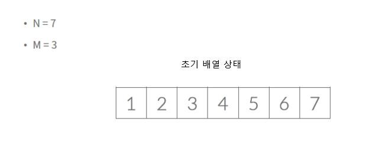
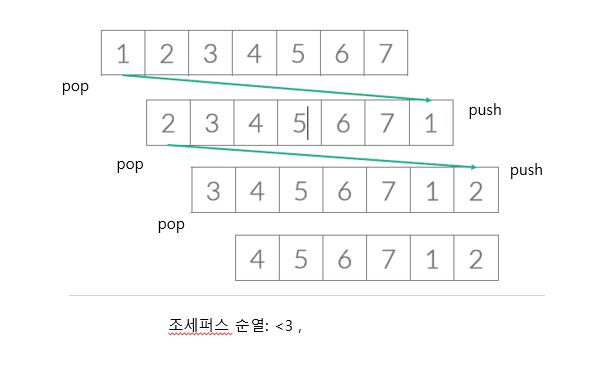
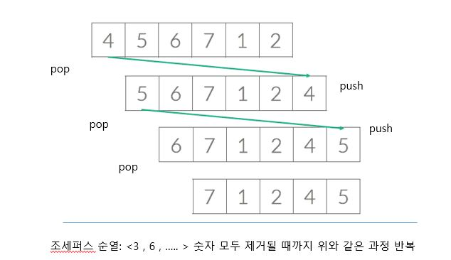

# [백준 1158번 문제- 조세퍼스](https://www.acmicpc.net/problem/1158)

- 1번부터 N번까지 N명의 사람이 원을 이루면서 앉아있음
- 양의 정수 M(<=N)이 주어짐
- 순서대로 M번째 사람을 제거
- 한 사람이 제거되면, 남은 사람들로 이루어진 원을 따라 위 과정을 계속해 나감
- N명의 사람이 모두 제거될 때까지 계속됨
- 원에서 사람들이 제거되는 순서를 (N,M)-조세퍼스 순열이라고 함

# 문제의 구현 (JAVA)



> -> 초기 큐 상태 입력받음



> -> 큐의 front에서 pop을 한 숫자를 rear에 다시 push를 한다. 마지막번호는 조세퍼스 순열에 배치해야 함으로 (M-1)번 push 수행



> -> 숫자 모두 제거될 때까지 위와 같은 과정 반복 수행

# 구현 소스(JAVA)

```
예제입력1
---------
7 3

예제출력1
---------
<3, 6, 2, 7, 5, 1, 4>
```

<Queue-Linked List .ver>

```JAVA
   1: import java.io.IOException;
   2: import java.util.LinkedList;
   3: import java.util.Queue;
   4: import java.util.Scanner;
   5:
   6: public class Main {
   7:     public static void main(String[] args) throws IOException{
   8:        Scanner sc= new Scanner(System.in);
   9:        int peopleNum=sc.nextInt(); //사람 수 입력
  10:        int delNum=sc.nextInt();//반복적으로 제거될 수
  11:        StringBuilder sb= new StringBuilder();
  12:        sb.append('<');
  13:        Queue<Integer> queue=new LinkedList<Integer>();
  14:        for(int i=1;i<=peopleNum;i++){
  15:            queue.offer(i);
  16:        }
  17:        for(int i=0;i<peopleNum-1;i++){
  18:            for(int j=0;j<delNum-1;j++){
  19:                queue.offer(queue.poll());
  20:            }//~for2
  21:            sb.append(queue.poll()+",");
  22:        }//~for
  23:        sb.append(queue.poll()+">");
  24:         System.out.println(sb);
  25:     }
  26: }
```

> 19: 큐에서 poll 한 값을 다시 큐에 offer

# 참고(Reference)

> [code.plus 코드플러스 알고리즘](https://code.plus/course/41)
