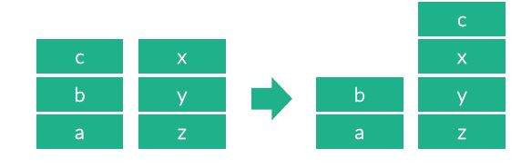

# [백준 1406번 문제- 에디터](https://www.acmicpc.net/problem/1406)


# 문제의 구현 (JAVA)

- **스택**을 이용해서 풀이가능
- 커서를 기준으로 커서의 왼쪽 스택(left)와 오른쪽 스택(right)로 나눠서 문제를 풀 수 있다.
- > 예: abc|xyz(|는 커서) <br> 

- > L: 커서를 왼쪽으로 한 칸 옮김 <br>
  > abc|xyz -> ab|cxyz <br> 

- > D: 커서를 오른쪽으로 한 칸 옮김<br>
  > abc|xyz -> abcx|yz <br> 

- > B: 커서를 왼쪽에 있는 문자를 삭제함 <br>
  > abc|xyz -> ab|xyz <br> 

- > P $ : $를 커서 오른쪽에 추가하고 커서는 \$의 오른쪽에 위치함 <br>
  > abc|xyz -> abcd|xyz <br> 

- **링크드리스트**를 이용해서도 풀이 가능

# 구현 소스(JAVA)

```
예제입력1
---------
abcd
3
P x
L
P y

예제출력1
---------
abcdyx
```

```
예제입력2
---------
abc
9
L
L
L
L
L
P x
L
B
P y

예제출력2
---------
yxabc
```

<Stack .ver>

```JAVA
   1: import java.io.BufferedReader;
   2: import java.io.IOException;
   3: import java.io.InputStreamReader;
   4: import java.util.LinkedList;
   5: import java.util.ListIterator;
   6: import java.util.Stack;
   7:
   8: public static void main(String[] args) throws IOException {
   9:         BufferedReader br = new BufferedReader(new InputStreamReader(System.in));
  10:         String s = br.readLine();
  11:         Stack<Character> left = new Stack<Character>();
  12:         Stack<Character> right = new Stack<Character>();
  13:         for (int i = 0; i < s.length(); i++) {
  14:             left.push(s.charAt(i)); //먼저 왼쪽 스택에 문자를 push
  15:         }
  16:         int repCnt = Integer.parseInt(br.readLine());
  17:         while (repCnt-- > 0) {
  18:             String[] line = br.readLine().split(" ");
  19:             char cmd = line[0].charAt(0);
  20:
  21:             if(cmd=='L'){ //왼쪽으로 커서이동
  22:                 if(!left.empty()){
  23:                     right.push(left.pop()); //왼쪽스택 pop->오른쪽 스택에 push
  24:                 }
  25:             }
  26:             else if(cmd=='D'){
  27:                 if(!right.empty()){
  28:                     left.push(right.pop()); //오른쪽스택 pop->왼쪽 스택에 push
  29:                 }
  30:             }
  31:             else if(cmd=='P'){
  32:                 char c=line[1].charAt(0);
  33:                 left.push(c);
  34:             }
  35:             else if(cmd=='B'){
  36:                 if(!left.empty())
  37:                     left.pop();
  38:             }
  39:         }//~while
  40:         while(!left.empty()){
  41:             right.push(left.pop());
  42:         }
  43:         StringBuilder sb=new StringBuilder(); //스택->문자열
  44:         while(!right.empty()){
  45:             sb.append(right.pop());
  46:         }
  47:         System.out.println(sb);
  48:     }
```

<linked list .ver>

```JAVA
 public static void main(String[] args) throws IOException{
        BufferedReader br = new BufferedReader(new InputStreamReader(System.in));
        String s = br.readLine();
        LinkedList<Character> str = new LinkedList<>();
        ListIterator<Character> idx = str.listIterator(str.size());
        for(int i=0; i<s.length(); i++)
            idx.add(s.charAt(i));
        int N = Integer.parseInt(br.readLine());

        while(N-->0){
            String cmd = br.readLine();
            try {
                if(cmd.equals("L"))
                    idx.previous(); //커서가 이전요소로 반환
                else if(cmd.equals("D"))
                    idx.next(); //커서가 다음요소로 반환
                else if(cmd.equals("B")) {
                    idx.previous();
                    idx.remove();
                } else if(cmd.equals("P"){
                    idx.add(cmd.charAt(2));
                }
            } catch (Exception e) {}
        }

        StringBuffer sb = new StringBuffer(600000); //링크드리스트->문자열
        for(char c : str)
            sb.append(c);
        System.out.println(sb);
    }
```

# 참고(Reference)

> [code.plus 코드플러스 알고리즘](https://code.plus/course/41)
