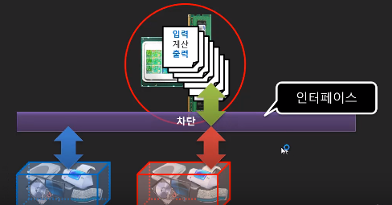

# 컴퓨터 프로그래밍을 하기 위한 사전지식 

### 8강  고급언어를 이용한 컴퓨터 프로그래밍

고급언어: 연산자, 제어구조, 변수, 배열의 기능을 제공하고 있음
↓
번역기(컴파일러)
↓
기계어(실행코드)

CPU와 Memory를 제외한 입출력장치들은 언어에서 제공하는 기능들이 아니다.
입출력도구들은 API(콘솔API,파일입출력 API )를 통해 기능이 실행됨

### 9강 고급언어의 API란?

입출력장치들은 왜 고급언어와 별개로 분리시켰는지?

장치가 달라졌을 경우 언어라는 것이 달라질 수 있는데 매번 달라지지 않고, 간접적으로 접근할 수 있는 도구를 API라고 한다.

프로그램에서 장치를 직접 쓰게하는 것을 차단하고, 간접적으로 사용하는 것이 인터페이스.
--> 프로그램을 만들 때 사용하는 인터페이스 : Application programming Interface

인터페이스 비유 예시)
우리가 집에서 TV를 켜기 위해서 리모콘을 들고 TV에 리모콘 전원 버튼을 누름으로써 TV가 켜지게됩니다. 즉, 사전에 TV와 통신을 하기 위해서 리모콘에서는 TV에 정의된 규격에 의해 어떤 신호를 보낼 수 있도록 만들어진 장치이며, 이러한 신호를 서로 주고 받기 위한 방법을 인터페이스라고 하는것

> 이미지 출처: youtube '뉴렉처' 

### 10강 API의 구현체 그리고 API와 플랫폼의 관계

절차언어 -> 프로그램(수행절차) -> API(Kakao.Auth...(),FB.login(),printf(), fprintf())를 통해서 플랫폼을 사용 -> 플랫폼 (카카오톡, 페이스북, 모니터 출력, 파일 출력)

## 참고(Reference)

- youtube '뉴렉처'