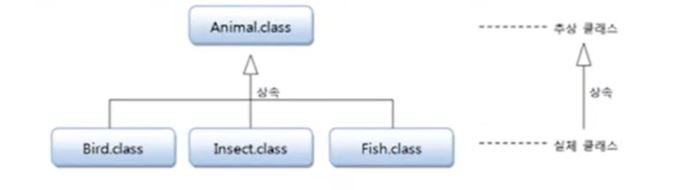

# Ch7.상속

## Ch7.8 추상클래스

### 추상클래스 개념

- 추상(abstract)

  - 실체들 간에 공통되는 특성을 추출한 것
    - ex1. 새, 곤충 --> 동물(추상)
    - ex2. 삼성,현대 --> 회사(추상)

- 추상 클래스(abstract class)
  - 실체 클래스들의 **공통되는** 필드와 메소드를 정의한 클래스
  - 추상 클래스는 실체 클래스의 부모 클래스 역할을 함
    
  - 추상 클래스는 단독으로 객체 생성을 할 수 없고, 부모 클래스로만 사용됨
  ```java
    Animal animal = new Animal(); (x)
    class Ant extends Animal {...} (o)
  ```

### 추상 클래스의 용도

- 추상 클래스의 공통된 필드와 메소드의 이름을 통일할 목적
  - 실체 클래스를 설계하는 사람이 여러사람일 경우
  - 실체 클래스마다 필드와 메소드가 제각기 다른 이름을 가질 수 있음
- 실체 클래스를 작성할 때 시간을 절약
  - 실체 클래스는 추가적인 필드와 메소드만 선언하면 됨
- 실체 클래스 설계 규격을 만들고자 할 때
  - 실체 클래스가 가져야할 필드와 메소드를 추상 클래스에 미리 정의해 놓고
  - 실체 클래스는 추상 클래스를 무조건 상속 받아 작성토록 함

### 추상 클래스 선언

```java
    public abstract class 클래스이름 {
        //필드
        //생성자
        //메소드
    }
```

<!--  https://www.youtube.com/watch?v=vxLT50-loCs&list=PLVsNizTWUw7FPokuK8Cmlt72DQEt7hKZu&index=72
8절.추상클래스 15분까지 작성
-->

# 참고(Reference)

> 이것이 자바다(신용권 저) 1권
