# 01.네트워크의 개념

## <01회차 네트워크 개요>

### 네트워크의 구성요소

---

- 네트워크는 노드(Node)라고 불리는 장치들이 통신링크로 연결된 집합체를 의미
  - 통신장치:PC, 서버(Server), 라우터(Router), 스위치(Swich)
  - 링크:유선, 무선

### 좋은 네트워크 조건

---

- 성능(Performance)

  - 처리량과 지연시간의 측면에서 측정가능
  - **처리량(throughput)**:링크를 통해 전달되는 단위시간당의 데이터의 양
  - **지연시간(delay)**:경유시간, 응답시간, 왕복시간
    - 경유시간: 한 장치에서 다른 장치로 데이터가 전달 되는데 걸리는 시간
    - 응답시간: 요청과 응답에 소요되는 시간
    - 왕복시간(RTT:Round Trip Time): 출발지에서 목적지까지 왕복하는데 걸리는 시간

- 신뢰성(Reliability)

  - 장애빈도, 장애 발생 후 회복시간, 재난에 대한 견고성 등으로 측정 가능

- 보안성(Security)
  - 불법적인 침입이나 정보유출에 대한 보안 확보

### 링크의 연결 형태

---

- 링크는 데이터를 한 장치에서 다른 장치로 전달하는 통신 경로
- 연결형태는 일대일(Point-to-Point)연결,
  멀티포인트(Multipoint 또는 Multidrop)연결로 나뉨

  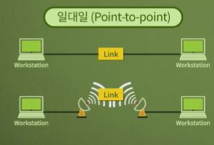

  > 송신자와 수신자가 1대1로 연결

  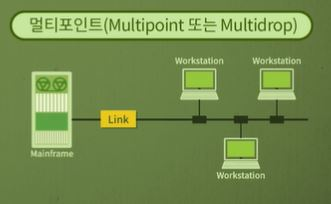

  > 매체 하나를 다수의 컴퓨터가 공유하는 형태

### 네트워크 구조

---

- 네트워크 토폴로지(Topology)

  - 네트워크의 구성요소인 _장치와 링크가 어떻게 배치되어 있는가_ 를 의미

  - 스타 형(Star)

    - 각 장치가 중앙의 장치에 일대일 연결되어 통신하는 형태

    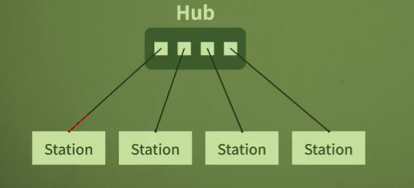

  - 버스 형(Bus)

    - 하나의 케이블에 여러 장치들이 연결되어 각 신호가 전체에 전달되는 형태
      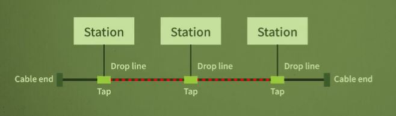

  - 링 형(Ring)

    - 장치들이 링 형태로 서로 연결되어 데이터가 링을 따라 한쪽 방향으로 전달
      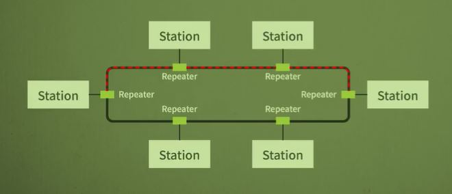

  - 그물 형(Mesh)
    - 각 장치가 일대일로 연결되어 서로가 일대일 통신하는 형태
      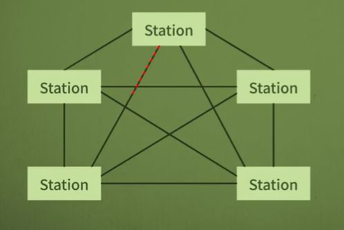

### 네트워크 분류

---

- 크기(얼마나 노드와 링크가 펼쳐져 있느냐), 소유권(네트워크 소유자), 구조 등에 의해서 분류

- LAN, MAN, WAN 으로 구분
  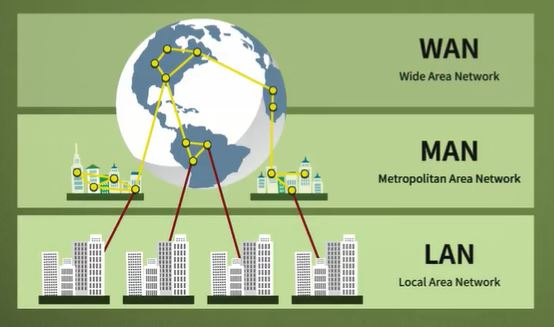

  - Local Area Network(LAN)

    - 보통 한 사무실, 건물, 캠퍼스 등에서 장치들이 서로 연결되며, **개인적으로 소유 가능**

  - Metropolitan-Area Network(MAN)

    - 도시 정도의 크기를 포함하는 규모

  - Wide Area Network(WAN)

    - 지역적으로 넓은 범위에서 데이터를 전송하기 위해 구성

    - **인터넷은 네트워크가 서로 연결된 전체 네트워크**

## <02회차 네트워크 모델과 표준 프로토콜>

### 계층화의 개념

---

- 특정 계층이 변경이 일어났을 때 다른 계층이 영향을 받지 않음

### TCP/IP 모델

---

- 인터넷 모델이라고도 함
  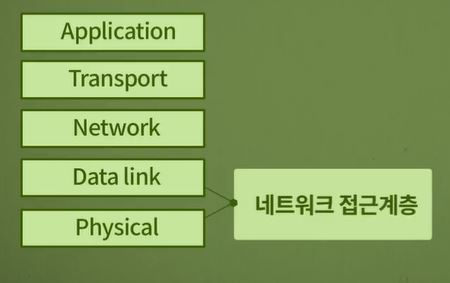

  - _물리계층_ 의 기능

    - 장치 연결 부분의 물리적인 특성을 명시
    - 비트의 전기적 혹은 광학적 표현
    - 데이터 속도, 비트의 동기화, 토폴로지, 전송 모드, 선로 구성 등에 관한 사항
      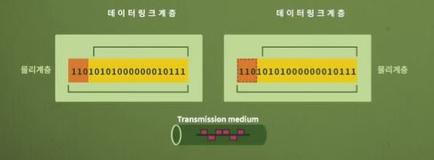
      > 데이터링크계층->물리계층->Transmission medium->물리계층->데이터링크계층

  - _데이터링크 계층_ 의 기능

    - 프레임화, 송수신 주소 명시, 흐름제어, 에러제어, 접근제어 등
      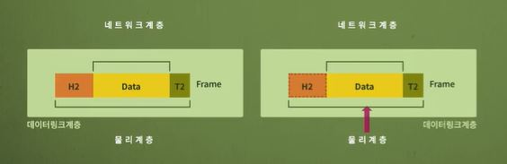

      > 네트워크계층->데이터링크계층->물리계층->데이터링크계층->네트워크계층

      - 에러제어: 비트에 대한 에러 검출과 복구

      - 흐름제어: 수신 측과 송신 측의 데이터처리 속도 차이를 해결

      - 접근제어: 여러 장치들이 동일한 링크를 공유할 때 충돌이 발생하지 않도록 조정

  - _네트워크 계층_ 의 기능

    - 초기 송신지에서 최종 수신지로 데이터를 전달하는 계층으로 송수신주소를 명시하고 라우팅을 수행
      - 라우팅:패킷을 최종 목적지로 경로 설정
        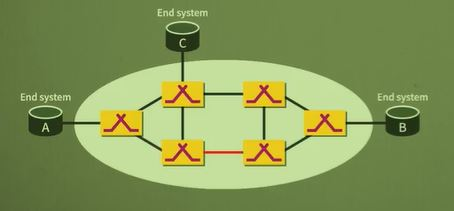

  - _수송 계층_ 의 기능

    - 프로세스에서 프로세스로 데이터를 전달
    - 송신지에서 보낸 전체 메시지가 온전하게 최종 목적지로 전달
    - 특정 프로세스에 대한 주소지정, 메시지를 세그먼트단위로 분할 및 조립, 연결제어, 종단간 흐름제어, 종단간 에러제어를 수행
      - 연결제어: 연결형(Connection-oriented)과 비연결형(Connectionless)에 대한 관리
        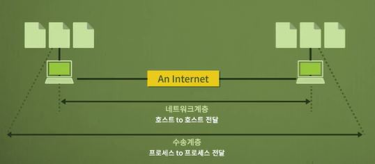

  - _응용 계층_ 의 기능
    - 파일을 송수신하는 FTP(File Transfer Protocol), 원격지 접속을 하는 Telnet
    - 전자우편을 주고받는 SMTP(Simple Mail Transfer Protocol), 하이퍼텍스트를 지원하는 HTTP(HyperText Transfer Protocol) 등 다양한 네트워크 서비스가 존재
      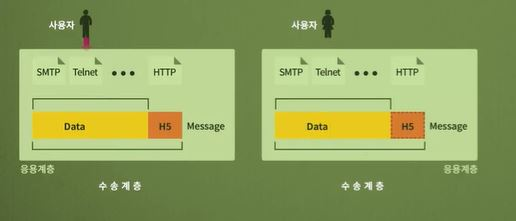

### 표준 프로토콜

---

- 프로토콜이란 데이터를 주고 받는데 이용되는 규칙의 집합
- 표준화 기구로 ISO, ITU-T, ANSI, IEEE, EIA 등이 존재
- 표준 프로토콜은 합의된 규칙으로 De facto 표준과 De jure 표준으로 구분

  - **De jure 표준**은 표준화를 제정하는 기구가 공식적으로 표준으로 사용할 것으로 규정한 것
  - **De facto 표준** 은 사실상 표준으로서 이미 많이 이용되고 있어서 표준으로 채택된 것

---

# 참고(Reference)

> - k-mooc 네트워크 기초 강의 (성균관대 안성진교수) 
> - Data Communications and Networking , Behrouz A. Forouzan

<!-- http://www.kmooc.kr/dashboard?status=end -->
