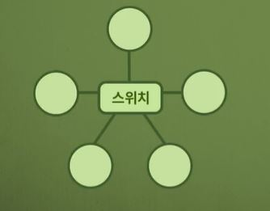
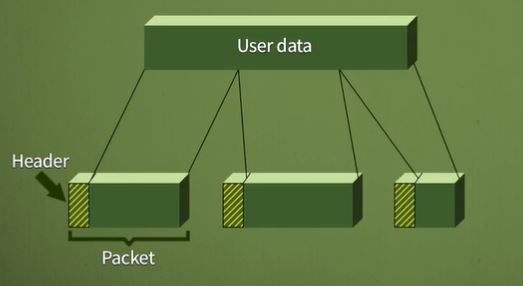
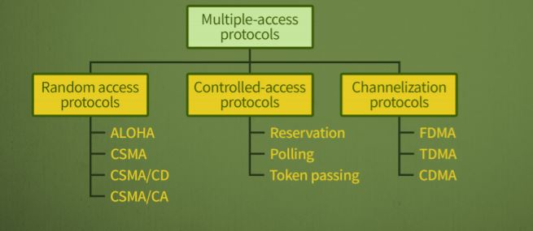
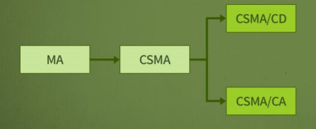
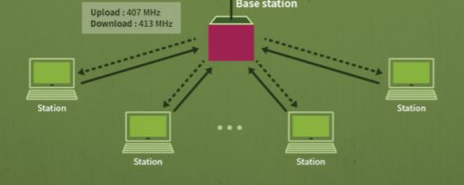
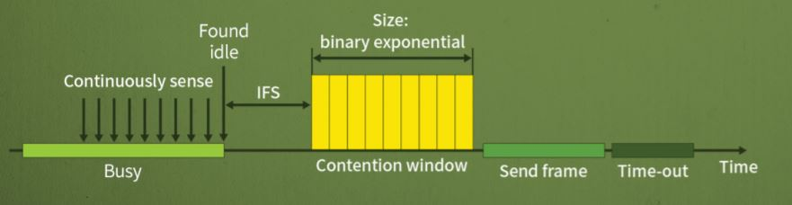

# 02.스위칭과 다중접속 프로토콜

## <01회차 스위칭 방법과 종류>

### 스위칭의 필요성

- 여러 개의 장치가 있는 경우,
  서로 데이터를 주고 받게 하기 위해 선으로 연결
- 모든 장치에 서로 링크로 연결되면 문제점이 발생
  - 장치가 많아질수록(큰 네트워크 일수록) 비용이 많이 발생
  - 링크의 대다수는 유휴시간(작업하지 않는 시간)이 많아 효율이 저하
- 문제점을 해결하기 위해 여러 장치들을 스위치에 연결되도록 구성
  - 스위치는 필요할 때마다 두 개의 장치를 연결
  - 스위치들이 연결되어 큰 규모의 네트워크를 만들 수 있음 
    

### 스위칭 방식의 종류

- 스위칭 방식

  - 회선교환(Circuit Switching)
    - 두 장치 사이에 물리적인(논리적인) 선을 연결하는 방식(두 장치 사이에 있는 선은 다른 사람이 이용하지 못함)
    - 전화망(PSTN)이 이 방식을 사용
      - PSTN: Public Switched Telephone Network
    - 특징
      - 회선 연결 시, 데이터를 주고 받는 동안 계속 유지 즉, **자원이 연결되어 있는 동안 계속 점유**
      - 두 장치 사이에 **고정된 속도**를 가짐
      - **연결을 설정**하는데 시간이 소요되며, 이후에는 지연시간이 없음
      - 데이터 **전송이 많은 경우 유용**
  - 메시지 교환(Message Switching)
    - 전달 할 메시지 전체를 한번에 인접노드로 모두 전달
    - 메시지를 수신하면 다음 노드로 메시지를 전달
      - **Store and forward** : 메시지가 오면 저장하고, 수신쪽으로 데이터를 보내고(forwawrd) 보내는 동안에 다른 컴퓨터는 사용하지 못하고 다 보낸 후에 사용가능)
    - 특징
      - 유휴 링크는 다른 메시지 전송에 사용함으로 효율적임
      - 각 노드는 메시지 저장공간 확보
  - 패킷 교환(Packet Switching)

    - 데이터를 패킷 단위로 나눠서 전송(메시지 교환에서 크기가 큰 데이터를 한번에 저장했는데, 패킷교환에서는 패킷 단위로 데이터를 나눠서 전송함으로 더욱 효율적임)
      
    - 특징
      - 군집성이 있는(bursty) 트래픽 전송에 적합
    - _데이터그램 방식_

      - 각 패킷이 서로 독립적으로 처리됨
      - 목적지에 **순서와 상관없이 도착** (최대 효율을 높여서 이동)
      - 연결설정과정이 없음
      - 항상 같은 경로로 전송하지 않음

    - _가상회선 방식_
      - 데이터를 보내기 전에 **연결설정**
      - 모든 패킷들이 가상회선을 따라서 앞뒤의 순서를 갖고 전송 ( 즉, **동일한 경로로 순서대로 목적지에 도착**)
      - 링크가 다른 전송과 공유

- MPLS(Multi-Protocol Label Switching)
  - 라우터 및 스위치처럼 작동이 가능함
    - 라우터처럼 동작할 경우, MPLS는 대상 주소를 기반으로 패킷을 전달
    - 스위치처럼 동작할 경우, Lable을 기반으로 패킷을 전달
  - _데이터그램방식_ 은 패킷을 어디로 보내는게 효율적일지 결정해서 보내야하기 때문에 시간이 걸림
    반면에, _가상회선방식_ 은 Label을 붙여서 패킷을 보내기 때문에 속도가 더 빠르다.

## <02회차 다중접속 프로토콜>

- 다중 접속(Multiple Access)

  - **링크를 여러 장치들이 공유하는 환경에서 전송을 시도하는 경우**를 의미
  - 일반적으로 데이터링크 계층에서 수행
    - 두 개의 부계층이 존재
    - 상위 부계층은 **데이터 링크**를 제어(Data link control)
    - 하위 부계층은 **공유 매체의 접근 문제를 해결**
      (Multiple-access resolution)
  - 여러 시스템이 공통의 링크에 연결된 경우, 멀티포인트연결이라 하는데, 이때 발생하는 매체접근 문제를 해결해야 함 
    
     
  - 무작위 접근(Random Access)

    - **서로 대등한 관계**의 통신을 하며, 한 시스템이 다른 시스템을 통제하지 않음
    - 임의의 시스템이 전송을 위해 **시간을 정하지 않음**
    - 어떤 시스템이 전송 할 차례인지 정하는 규칙이 없음
      - 경쟁(Contention)
    - 여러 시스템이 전송하면 충돌(collision)이 가능하며, 해당 프레임은 손상되어 재사용 부가능
    - 무작위 접근방식의 발전 단계 
      
      > 무작위 접근방식 성능개선(CSMA)->유선환경(CSMA/CD) / 무선환경(CSMA/CA) 로 발전

  - ALOHA
    - 1970년대 초반 미국 하와이 대학교에서 개발
      - 무선 LAN으로서 9600bps 속도로 동작
    - 기본적인 동작
      - 각 시스템은 기지국(base station)으로 데이터 전송
      - 기지국은 수신된 프레임을 목적지로 전달
      - 송신 시스템은 ACK(Acknowledgement)를 기다림(수신측에서 데이터를 잘 받았음을 나타냄)
        
  - CSMA(Carrier Sense Multiple Access)

    - 각 시스템은 데이터를 전송하기 전에 **매체를 우선적으로 검사**
      - sense before transmit 또는 listen before talk 이라고 함(데이터를 보내기 전에 일단 누가 보내나 안 보내나 들여다보는 의미)
    - 전파지연시간으로 인해 여전히 **충돌 가능성**은 있음

  - CSMA/CD(CSMA with Collision Detection)

    - 유선환경
    - CSMA방식에서 충돌 발생에 대한 절차 추가
      - 데이터가 깨지는지 안 깨지는지 확인해보는 것을 CD(collision detection)라고 함
    - 데이터를 전송한 시스템은 **전송의 성공여부를 계속 감시**
      - 충돌이 감지되면 즉시 전송 중지

  - CSMA/CA(CSMA with Collision Avoidance)
    - CSMA/CD에서 충돌 시, 두 배의 에너지 발생으로 충돌 감지 가능
    - 무선네트워크에서는 충돌 감지가 어려움
    - 충돌을 피하기 위해 CSMA/CA에서는 3가지 기법 사용
      - IFS(InterFrame Space) : 채널이 빈 경우라도 **바로 보내지 않고 잠시 기다려 충돌을 회피**
      - 충돌 윈도우(Contention window)
        : 전송 준비 완료 시 임의의 수를 선택하여 시간만큼 기다림
        - A random number of slots을 의미
      - ACK(Acknowledgments)
        : 데이터를 수신한 시스템이 보내는 응답을 의미, ACK가 없는 경우 송신 시스템은 데이터가 유실되었다고 판단
        

- 통제된 접근(Controlled Access)

  - 하나의 시스템이 제어국이 되어 다른 시스템들의 전송권한을 제어
  - 동시에 둘 이상의 시스템이 전송을 못하게 함으로써 충돌제어
  - 시스템들은 자신의 순서가 돌아오기 전까지는 전송 불가능
  - 예약(Reservation)
    - 시스템은 데이터를 송신하기 전에 예약 필요
    - N개의 시스템은 N개의 예약된 mini slot이 예약 프레임 내부에 존재
    - 예약된 시스템은 데이터프레임을 예약 프레임 뒤에 전송
  - 폴링(Polling)
    - 제어 시스템과 송수신 시스템으로 구성
    - 송신 시 제어 시스템에게 알림, 수신 시 제어시스템에게 문의
      (ex. 데이터 보낼 것이 있는지 중앙에서 통제)
  - 토큰 전달(Token Passing)
    - 토큰을 가진 시스템이 데이터를 송신 할 권한을 가짐

- 채널화(Channelization)
  - 링크를 시간, 주파수, 코드로 나누어서 여러 개의 채널을 만들고 이들을 서로 다른 시스템들이 이용하는 방법
    - Frequency-Division Multiple Access(FDMA) : 주파수 분할 다중 접속
      - 사용 가능한 대역폭은 모든 시스템이 공유
      - 각 시스템은 할당된 대역을 이용하여 데이터 전송
      - 각 대역은 특정 시스템을 위해 예약 됨
    - Time-Division Multiple Access(TDMA): 시간 분할 다중 접속
      - 단일 주파수 대역을 사용
      - 주파수를 시간간격으로 분할하여 모든 시스템이 동시에 데이터 전송
    - Code-Division Multiple Access(CDMA) : 코드 분할 다중 접속
      - 링크가 전체 대역폭을 하나의 채널에서 공유
      - 모든 시스템은 시분할 없이 동시에 데이터 송신 가능

# 참고

> - k-mooc 네트워크 강의 (성균관대 안성진교수) 
> - Data Communications and Networking , Behrouz A. Forouzan
