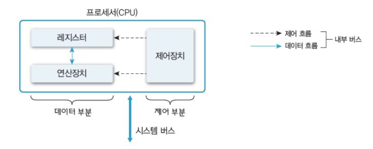

# 컴퓨터 시스템 개요

### 컴퓨터 하드웨어

- 프로세서(Processor) :

  - CPU
  - 그래픽카드(GPU)
  - 응용 전용 처리장치 등

- 메모리

  - 주 기억장치
  - 보조 기억장치 등

- 주변장치
  - 키보드/ 마우스
  - 모니터, 프린터
  - 네트워크 모뎀 등

### 프로세서 (Processor)

- 컴퓨터의 두뇌(중앙처리장치)
  - 연산 수행
  - 컴퓨터의 모든 장치의 동작 제어
    

### 레지스터 (Register)

- 프로세서 내부에 있는 메모리

  - 프로세서가 사용할 데이터 저장
  - 컴퓨터에서 가장 빠른 메모리

- 레지스터의 종류

  - **용도에 따른** 분류
    - 전용 레지스터, 범용 레지스터
  - **사용자가 정보 변경 가능 여부**에 따른 분류

    - 사용자 가시 레지스터
      - 데이터 레지스터(DR)
      - 주소 레지스터(AR)
    - 사용자 불가시 레지스터

      - 프로그램 카운터(PC) : 다음에 실행할 명령어의 주소를 보관하는 레지스터
      - 명령어 레지스터(IR): 현재 실행하는 명령어를 보관하는 레지스터
      - 누산기(ACC) :데이터를 일시적으로 저장하는 레지스터
      - 메모리 주소 레지스터(MAR) : 프로세서가 참조하려는 데이터의 주소를 명시하여 메모리에 접근하는 버퍼 레지스터
      - 메모리 버퍼 레지스터(MBR)= 메모리 데이터 레지스터(MDR) : 프로세서가 메모리에서 읽거나 메모리에 저장할 데이터 자체를 보관하는 버퍼 레지스터

  - **저장하는 정보의 종류**에 따른 분류
    - 데이터 레지스터, 주소 레지스터, 상태 레지스터

### 운영체제와 프로세서

- 프로세서에게 처리할 작업 할당 및 관리

  - 프로세스(Process) 생성 및 관리

- 프로그램의 프로세서 사용 제어
  - 프로그램의 프로세서 사용 시간 관리
  - 복수 프로그램간 사용 시간 조율 등

<!-- https://www.youtube.com/watch?v=EdTtGv9w2sA&list=PLBrGAFAIyf5rby7QylRc6JxU5lzQ9c4tN -->
<!-- p.11까지 작성 -->

# 참고(Reference)

> [HPC Lab., KOREATECH](https://sites.google.com/view/hpclab/courses/operating-system)
