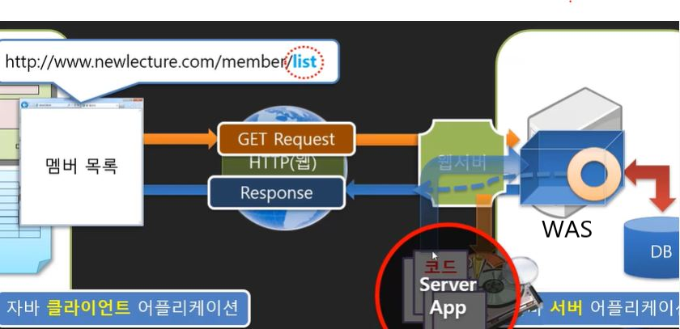
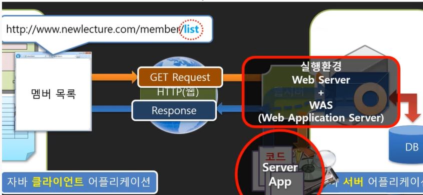
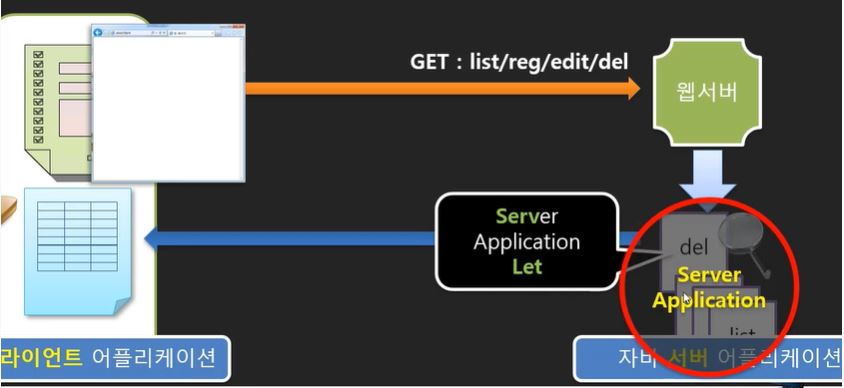

# 웹 서버 프로그램과 Servlet

웹서버에 추가적으로 사용자가 요구하는 내용이 동적으로 요구하는 문서이면 코드를 실행해서 결과를 돌려줄 수 있는 것을 _WAS(Web Application Server)_ 라고 한다.

> WAS(Web Application Server)
>
> - 웹 애플리케이션과 서버 환경을 만들어 동작시키는 기능을 제공하는 소프트웨어 프레임워크
> - 인터넷 상에서 HTTP를 통해 사용자 컴퓨터나 장치에 애플리케이션을 수행해 주는 미들웨어(소프트웨어 엔진)으로 볼 수 있음
> - 웹 애플리케이션 서버는 동적 서버 콘텐츠를 수행하는 것으로 일반적인 웹 서버와 구별이 되며, 주로 데이터베이스 서버와 같이 수행  
>   (출처:wikipedia)

Server App: 동적으로 문서를 만들기 위한 코드

Web Server+ WAS : Server App이 실행될 수 있는 환경

> 자바 서블릿(Java Servlet)
>
> - 자바를 사용하여 웹페이지를 **동적으로 생성하는 서버측 프로그램**
> - 웹 서버의 성능을 향상하기 위해 사용되는 **자바 클래스**의 일종
> - JSP가 HTML 문서 안에 Java 코드를 포함하고 있는 반면, 서블릿은 **자바 코드 안에 HTML을 포함**하고 있음
>   (출처:wikipedia)

> 참고 : 2019 Servlet&JSP 프로그래밍(youtube 뉴렉처)

<!-- 서블릿/JSP강의05까지 정리 -->
