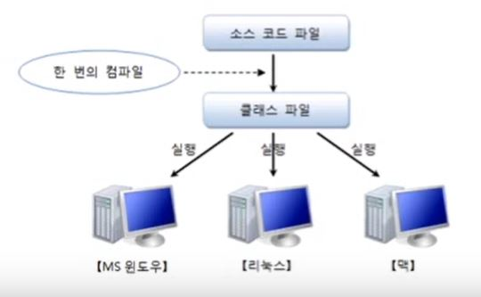
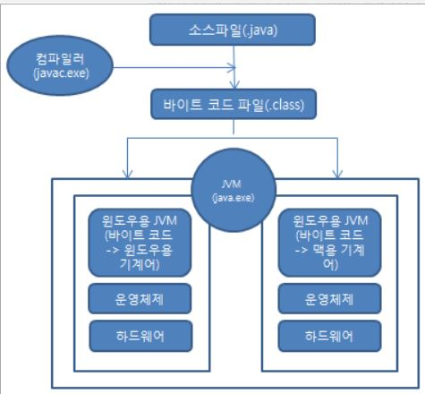

# 1.1 프로그래밍 언어란?

- 프로그래밍 언어는 **고급 언어**와 **저급 언어**로 구분 됨
  - 고급 언어: 컴퓨터와 대화할 수 있도록 만든 언어 중 사람이 쉽게 이해할 수 있는 언어(ex.C,C++,JAVA..)
    - 고급 언어로 작성된 소스는 컴퓨터가 바로 이해할 수 없기 때문에 컴파일(compile)과정을 통해 컴퓨터가 이해할 수 있는 0과 1 로 이루어진 기계어로 변환
    - 고급언어들로 작성된 내용을 **소스(source)** 라고 부르고, 이 소스는 **컴파일러(compiler)** 라는 소프트웨어에 의해 기계어로 변환된 후 컴퓨터에서 실행
    - 컴퓨터에서 특정 목적을 수행하기 위해 프로그래밍 언어로 작성된 소스를 기계어로 번역한 것을 **프로그램(program)** 이라고 함
  - 저급 언어: 기계어에 가까운 언어(ex.어셈블리어..)

# 1.2 자바란?

### <자바 특징>

- 이식성이 높은 언어
  - 이식성:서로 다른 실행 환경을 가진 시스템 간에 프로그램을 옮겨 실행할 수 있는 것
  - 자바 실행 환경(JRE:Java Runtime Environment)이 설치되어 있는 모든 운영체제에서 실행 가능
    
    > 클래스파일=바이트 코드 파일
- 객체 지향 언어
  - 객체들을 먼저 만들고, 이것들을 하나씩 조립 및 연결해서 전체 프로그램을 완성하는 기법을 **객체 지향 프로그래밍(OOP:Object Oriented Programming)** 이라고 함
- 함수적 스타일 코딩을 지원

  - 대용량 데이터의 병렬 처리, 이벤트 지향 프로그래밍을 위해 적합한 함수적 프로그래밍
  - 함수적 프로그래밍을 위해 람다식(Lambda Expressions)을 자바8부터 지원

- 메모리를 자동으로 관리

  - 객체 생성 시 자동적으로 메모리 영역을 찾아서 할당하고, 사용이 완료되면 쓰레기 수집기(Garbage Collector)를 실행시켜 자동적으로 사용하지 않는 객체를 제거시켜줌

- 다양한 애플리케이션을 개발 가능

  - 다양한 운영체제에서 사용할 수 있는 개발 도구와 API를 묶어 에디션(Edition)형태로 정의

    > - JAVA SE(Standard Edition)->기본 에디션
    >   > ※ JAVA SE는 자바 프로그램들이 공통적으로 사용하는 자바 가상 기계(JVM:Java Virtual Machine)를 비롯해서 자바 프로그램 개발에 필수적인 도구,라이브러리 API를 정의함  
    >   > ※ 자바 프로그램을 개발하고 실행하기 위해서는 JavaSE 구현체인 자바 개발 키트(JDK:Java Development Kit)를 설치해야함

    > - JAVA EE(Enterprise Edition)->서버용 애플리케이션 개발 에디션
    >   > ※ JAVA EE는 분산 환경(네트워크,인터넷)에서 서버용 애플리케이션을 개발하기 위한 도구 및 라이브러리 API를 정의  
    >   > ※ Servlet/JSP를 이용한 웹 애플리케이션, 분산 처리 컴포넌트인 EJB(Enterprise Java Bean), XML 웹 서비스(Web Services) 등이 있음

- 멀티 스레드(Multi-Thread)를 쉽게 구현 가능
  - 운영체제에 따라서 멀티 스레드를 구현하는 방법이 다르지만, 자바는 스레드 생성 및 제어와 관련된 라이브러리 API를 제공하고 있기 때문에 **운영체제에 상관없이 멀티 스레드를 쉽게 구현할 수 있음**
- 동적 로딩(Dynamic Loading)을 지원

  - 애플리케이션이 실행될 때 모든 객체가 생성되지 않고, 객체가 필요한 시점에 클래스를 동적로딩해서 객체를 생성함

- 오픈소스 라이브러리 풍부함

  - 자바는 오픈소스언어이기 때문에 자바 프로그램에서 사용하는 라이브러 또한 오픈소스가 풍부함

---

### <자바 가상 기계(JVM:Java Virtual Machine)>

- 운영체제는 자바 프로그램을 바로 실행할 수 없는데, 그 이유는 자바 프로그램은 완전한 기계어가 아닌, 중간 단계의 바이트 코드이기 때문에 이것을 해석하고 실행할 수 있는 가상의 운영체제가 필요한데 이것이 자바 가상 기계(JVM)이다.
- JVM은 실 운영체제를 대신해서 자바 프로그램을 실행하는 가상의 운영체제 역할을 한다.
- 바이트 코드 파일은 JVM 구동 명령어(java.exe)에 의해 JVM에서 해석되고 해당 운영체제에 맞게 기계어로 번역됨

> 참고: 이것이 자바다(신용권 저) 1권
