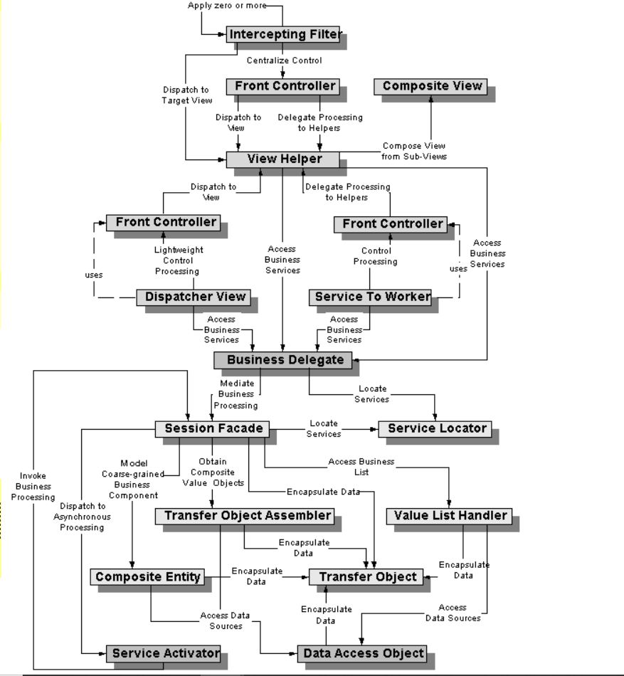

# 적어도 MVC 모델은 적용해야죠

- MVC

  - Model
    - 뷰에서 입력된 내용을 저장,관리,수정
    - 이벤트에 대한 실질적인 일을 함
  - View
    - 사용자가 결과를 보거나 입력할 수 있는 화면
  - Controller
    - 뷰와 모델의 연결자
    - 뷰에서 받은 이벤트를 모델로 연결하는 역할을 함

- JSP 모델1

  - JSP에서 자바 빈을 호출하고 DB에서 정보를 조회,등록,수정,삭제 업무를 한 후 결과를 브라우저로 보내 주는 방식
    - 장점 : 간단하게 개발할 수 있음
    - 단점 : 개발 후 프로세스 변경이 생길 경우에 수정이 어려움

- JSP 모델2
  - JSP 모델1의 단점을 해결한 모델
  - MVC 모델을 정확히 따름
  - JSP로 요청을 직접 하는 JSP모델1과 다르게 JSP모델2는 서블릿이 컨트롤러 역할 수행

# J2EE 디자인 패턴이란?

- 디자인 패턴 : 시스템을 만들기 위해서 전체 중 일부 의미 있는 클래스들을 묶은 각각의 집합

> 그림1 | Core J2EE Pattern Catalog
> (출처: http://www.corej2eepatterns.com/Patterns/ )

위 그림은 사용자의 요청이 처리되는 순서로 생각하면서 위에서부터 아래로 보면 된다.

가장 윗부분은 **_프레젠테이션 티어_**, 중간 부분은 **_비즈니스 티어_**, 하단부분은 **_인테그레이션 티어_**

위로 갈수록 화면에 가깝고, 아래로 갈수록 DB와 같은 저장소에 가깝다고 생각하면 쉽다.

update ~191104.~page8
